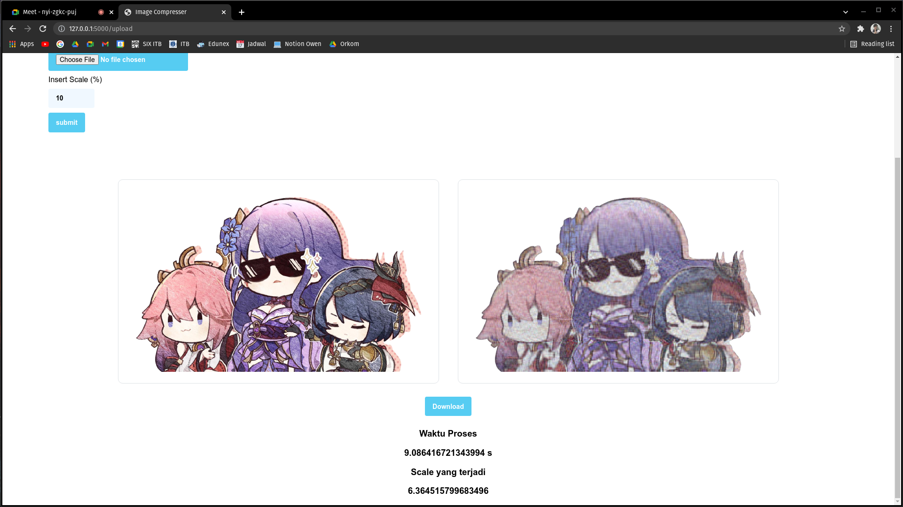

# Image Compression with SVD method
> Image compression with svd method without using numpy.linalg.eig() or numpy.linalg.svd().
> Eigenvalues and eigenvectors are calculated using QR method.

## Table of Contents
* [General Info](#general-information)
* [Technologies Used](#technologies-used)
* [Features](#features)
* [Screenshots](#screenshots)
* [Setup](#setup)
* [Usage](#usage)
* [Project Status](#project-status)
* [Room for Improvement](#room-for-improvement)
* [Acknowledgements](#acknowledgements)
* [Contact](#contact)
<!-- * [License](#license) -->

## General Information
- The goal of this project is to implement a web that compress and image with SVD method. 
- the SVD were calculated without any help from libraries that could calculate eigenvalues/ eigenvectors/ svd directly. 
- Students were asked to implement what thay got in class by making their own code to calculate eigenvaluses, eigenvectors, and svd.

## Technologies Used
- Python 3.9.2
- Flask 2.0.2
- numpy 1.21.4
- OpenCV 2.3. 1
- Pillow 2.2.1

## Features
List the ready features here:
- Image Compression
- Image Downloads

## Screenshots

## Setup
Prerequirement:
1. Python :https://www.python.org/downloads/
2. Pip    :https://pip.pypa.io/en/stable/installation/

Requirement:
In terminal:
  1. pip install Flask
  2. pip install numpy
  3. pip install Pillow
  4. pip install opencv-python
  5. pip install -U Flask-WTF
  6. pip install -U WTForms 

## Usage
How does one go about using it?
Provide various use cases and code examples here.
Method 1:
  `source venv/bin/activate`
  `cd src`
  `export FLASK_APP=main`

method 2:
  `cd src`
  `python main.py`

## Project Status
Project is:  _no longer being worked on_

## Room for Improvement
1. implement a better SVD algorithm
